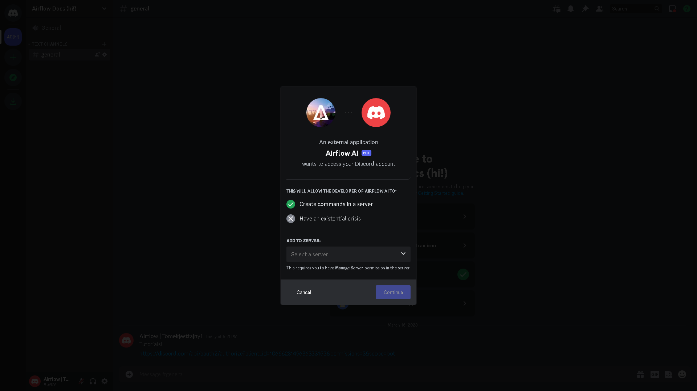

# Invite the bot

First you need to create a discord server (if you dont have one)

If you invite it, you will be able to invite the plus version

Next, invite the bot



And check if its online

 (2).png>)(sidebar)

If not, contact us on discord!

You are good to go! Next Page: Airflow AI Basic commands

